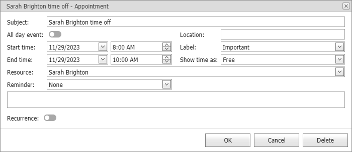

<!-- default badges list -->

<!-- default badges end -->

# Scheduler for ASP.NET Web Forms - How to implement an appointment edit form with custom fields on the client

This example demonstrates how to use client appointment objects and methods to implement an appointment edit form with custom fields that operate through client scripts.

## Files to Review

* [Default.aspx](./CS/WebSite/Default.aspx) (VB: [Default.aspx](./VB/WebSite/Default.aspx))
* [Default.aspx.cs](./CS/WebSite/Default.aspx.cs) (VB: [Default.aspx.vb](./VB/WebSite/Default.aspx.vb))
* [ScriptAppointmentForm.ascx](./CS/WebSite/UserForms/ScriptAppointmentForm.ascx) (VB: [ScriptAppointmentForm.ascx](./VB/WebSite/UserForms/ScriptAppointmentForm.ascx))
* [ScriptRecurrenceForm.ascx](./CS/WebSite/UserForms/ScriptRecurrenceForm.ascx) (VB: [ScriptRecurrenceForm.ascx](./VB/WebSite/UserForms/ScriptRecurrenceForm.ascx))
<!-- feedback -->
## Does this example address your development requirements/objectives?

 

(you will be redirected to DevExpress.com to submit your response)
<!-- feedback end -->
